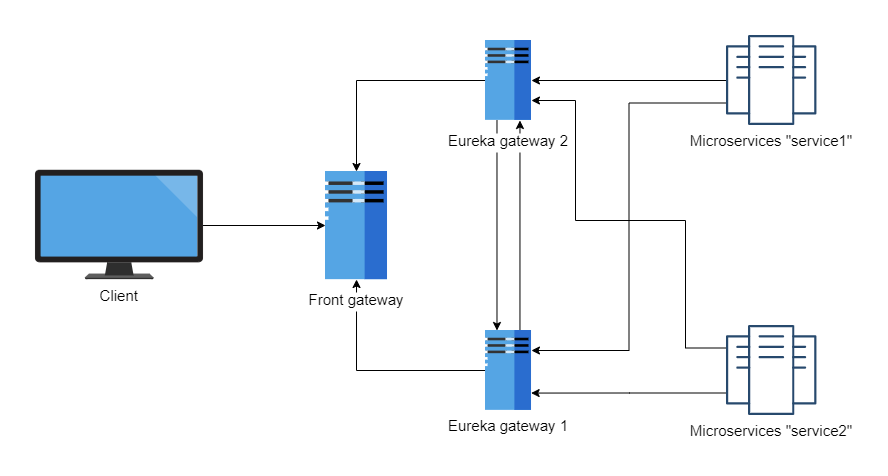

# Service discovery

## Gateways

### Front Gateway
The Front Gateway is an entry point to the application. The purpose of this gateway is load balancing between gateways

Navigate to http://front-gateway:8888 to see an Eureka dashboard

### Service register gateways
There are 2 gateway projects. Each of them uses `EurekaServer` and `ZuulProxy` modules. They are service registers of our microservices

To run this example you have to edit your hosts file with:
````
127.0.0.1 front-gateway
127.0.0.1 gateway1
127.0.0.1 gateway2
````

Alternatively you can edit all of the config files to use other hosts (e.g. localhost).

## Clients
There are 2 client projects. They register themselves in the Gateways.

## Examples
There are several use cases:
- call a gateway with a `v1/client1` or `v1/client2` prefix to be proxied to an appropriate microservice (e.g. GET to http://front-gateway:8888/api/client1/v1/client1/123)
- call a `v1/client2/{userId}` which gets a `client1` address from a `discoveryClient` (e.g. GET to http://front-gateway:8888/api/client2/v1/client2/123)
- upload files to `client2` which gets a `client1` address from a `discoveryClient` and passes files to the `client1` to be processed (e.g. POST to http://front-gateway:8888/api/client2/v1/client2/files/upload)


## Diagram
